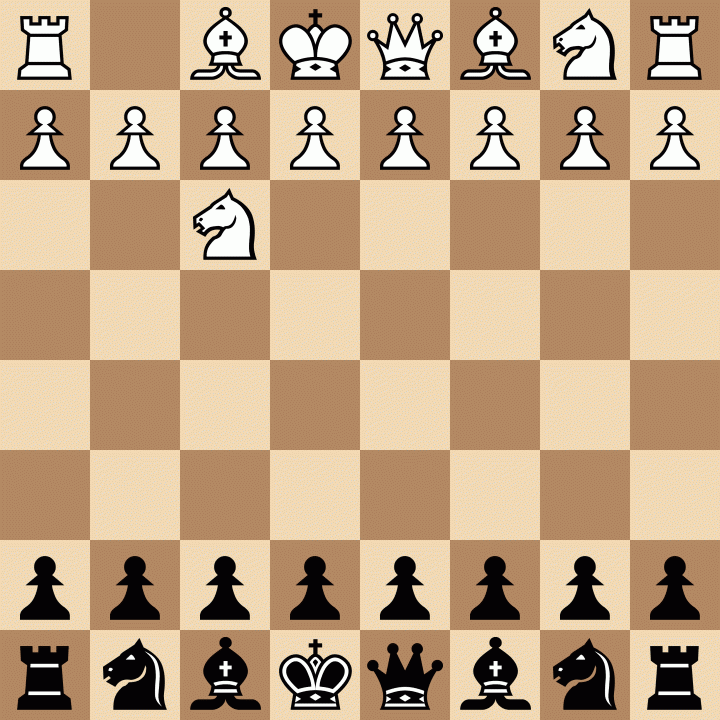

# Calico

This was my original chess engine with a strength of about 3100 elo, it supports the standard UCI chess engine protocol, and so any chess gui should be able to run it. Currently I am working on a new minimalistic engine [Tabby](https://github.com/ffloof/Tabby/). It aims to play at a superhuman level in as few lines of clean code as possible (currently around ~2550 elo and 850 LOC).

---

Tabby has played against a National Master over the board at our local chess club via a robotic arm system and a camera using computer vision that I implemented for it, and it won with the black pieces. This was an earlier version that had some bugs and fewer features that was around 2300 rated strength which is the same strength required by the USCF to achieve the title of national master so I thought it would be a fair game. It was a very close game throughout though the engine made some mistakes due to the aformentioned bugs that I couldnt replicate when testing it against the same positions later at home. A more detailed account of the game can be found on [Tabby's repository](https://github.com/ffloof/Tabby/).



```1. Nf3 Nf6 2. g3 d5 3. Bg2 c5 4. c4 e6 5. O-O d4 6. e3 Be7 7. a3 a5 8. exd4 cxd4 9. b3 O-O 10. Re1 Nc6 11. d3 Bd6 12. Ng5 h6 13. Ne4 Nxe4 14. Bxe4 f5 15. Bg2 Qb6 16. f4 Bd7 17. Nd2 Rf6 18. Rb1 g5 19. Nf3 gxf4 20. Bxf4 Bxf4 21. gxf4 Kh8 22. Qd2 Rg8 23. Kh1 Rfg6 24. Re2 Nd8 25. Ne5 R6g7 26. b4 Qd6 27. c5 Qc7 28. Qb2 Nc6 29. Nxd7 Qxd7 30. bxa5 Nxa5 31. Bf3 Nc6 32. Rg2 Qc7 33. Qd2 Nd8 34. Rxg7 Rxg7 35. Rc1 h5 36. Rc4 Nc6 37. Ra4 h4 38. Ra8+ Kh7 39. Qd1 Nd8 40. Qc1 Rg6 41. Qf1 Rg8 42. Qc1 Rg7 43. Qf1 Nf7 44. Ra7 Qxf4 45. Rxb7 Ne5 46. Rxg7+ Kxg7 47. Be2 Qd2 48. a4 h3 49. a5 Qxa5 50. Qxh3 Qxc5 51. Qg3+ Kh7 52. Qh4+ Kg6 53. Qg3+ Kf6 *```

---

The original engine Calico started out as a way to play with Monte Carlo Tree Search, and to learn the Go programming language which I am quite fond of, however since then I moved to a more traditional C++ engine with AlphaBeta style search for the engine. It includes the following features...

- [Efficiently Update Neural Networks (NNUE)](https://www.chessprogramming.org/NNUE)
- [Transposition Table w/ Zobrist Hashing](https://www.chessprogramming.org/Transposition_Table)
- [Principal Variation Search](https://www.chessprogramming.org/Principal_Variation_Search)
- [Null Move Pruning](https://www.chessprogramming.org/Null_Move_Pruning)
- [Reverse Futility Pruning](https://www.chessprogramming.org/Reverse_Futility_Pruning)
- [Late Move Pruning]
- [History Heuristic](https://www.chessprogramming.org/History_Heuristic)
- [Late Move Reductions](https://www.chessprogramming.org/Late_Move_Reductions)
- [Check Extensions](https://www.chessprogramming.org/Check_Extensions)
- [MVVLVA Capture Move Ordering](https://www.chessprogramming.org/MVV-LVA)
- [Aspiration Windows](https://www.chessprogramming.org/Aspiration_Windows)
- [Iterative Deepening](https://www.chessprogramming.org/Iterative_Deepening)
- [Internal Iterative Reductions](https://www.chessprogramming.org/Internal_Iterative_Reductions)
- [Quiescence Search](https://www.chessprogramming.org/Quiescence_Search)
- [Countermove Heuristic](https://www.chessprogramming.org/Countermove_Heuristic)
- [Killer Move Heuristic](https://www.chessprogramming.org/Killer_Heuristic)
- [UCI Chess Interface](https://www.chessprogramming.org/UCI)
- And many more that I have probably forgotten...

---

Some random notes...

https://www.computerchess.org.uk/ccrl/404/

Blitz
2900 = ice4/4ku
3000 = PESTO
3400 = Stockfish 8 (No NNUE)
3700 = Stockfish 15 (NNUE)

https://github.com/Gigantua/Chess_Movegen/blob/main/BinaryNeuralNetwork.hpp

QUEEN ONLY PROMOTIONS PERFT:
    rnbqkbnr/pppppppp/8/8/8/8/PPPPPPPP/RNBQKBNR w KQkq - 0 1 (startpos)
        1: 20
        2: 400
        3: 8902
        4: 197281
        5: 4865609
        6: 119060324

    r3k2r/p1ppqpb1/bn2pnp1/3PN3/1p2P3/2N2Q1p/PPPBBPPP/R3K2R w KQkq - (kiwipete)
        1: 48
        2: 2039
        3: 97862
        4: 4074224
        5: 193301718

    8/2p5/3p4/KP5r/1R3p1k/8/4P1P1/8 w - - (endgame)
        1: 14
        2: 191
        3: 2812
        4: 43238
        5: 674624
        6: 11024419

    rnbq1k1r/pp1Pbppp/2p5/8/2B5/8/PPP1NnPP/RNBQK2R w KQ - 1 8  (castles)
        1: 41
        2: 1373
        3: 54007
        4: 1806790
        5: 72590339

